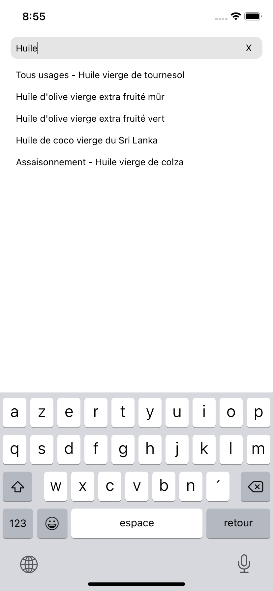
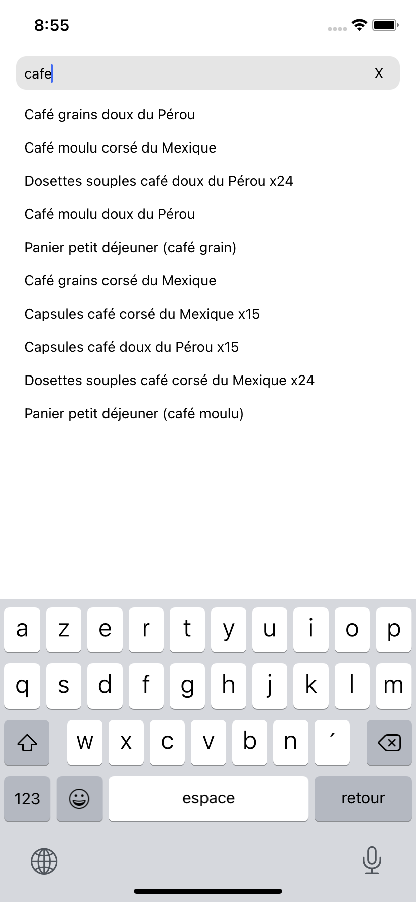

# Technical challenge - Experienced mobile engineer / Craftman JS - React Native

## Screenshots

## Améliorations possibles

* Corriger la FlatList si beaucoup de résultat, les derniers sortent de l'écran
* Créer un composant pour les items de la liste avec les tests associés

* Si la liste de produit s'agrandi de manière importante prévoir un délais avant d'exécuter la logique de recherche, afin d'éviter les appels inutiles qui pourrait ralentir l'app et ainsi impacter l'expérience utilisateur
